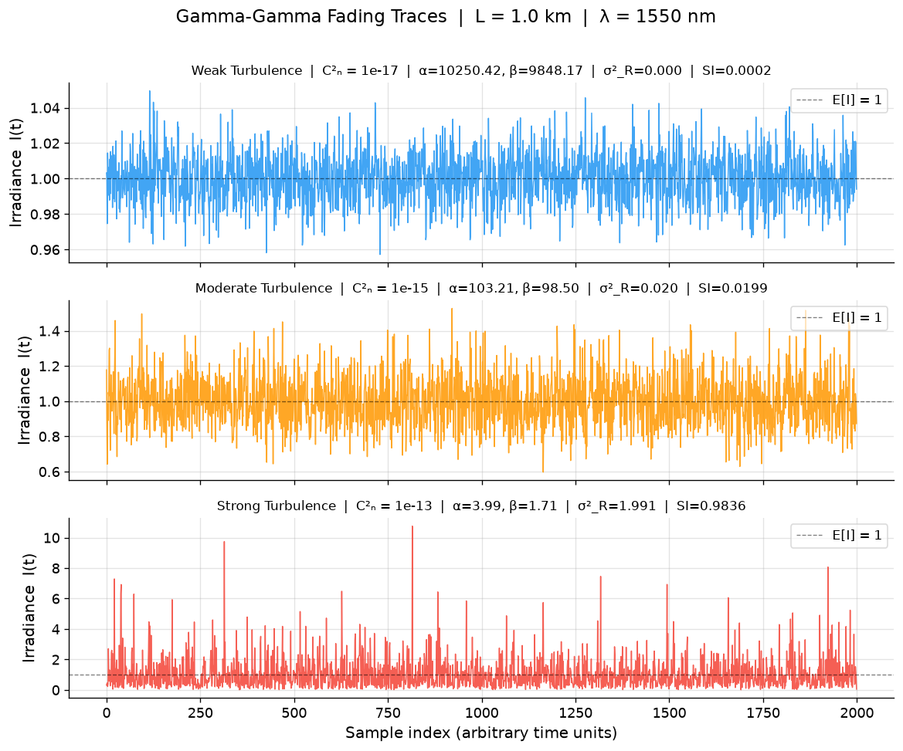
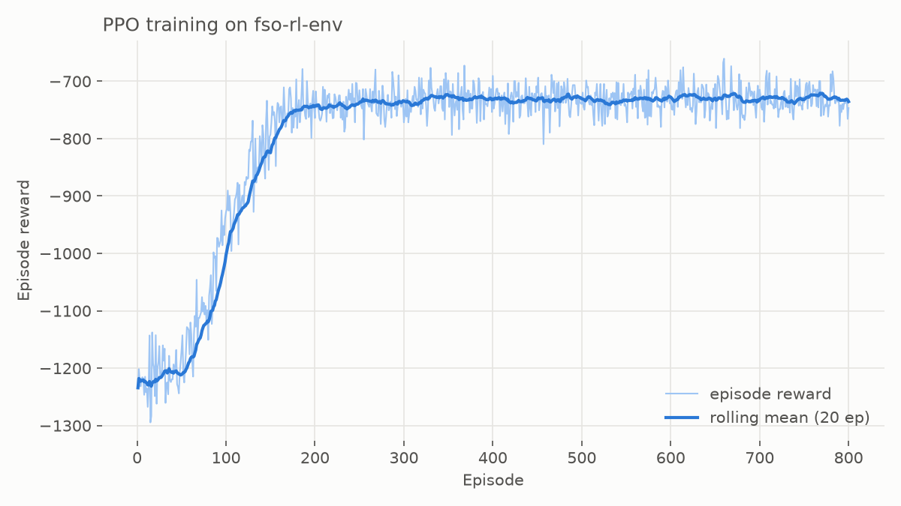
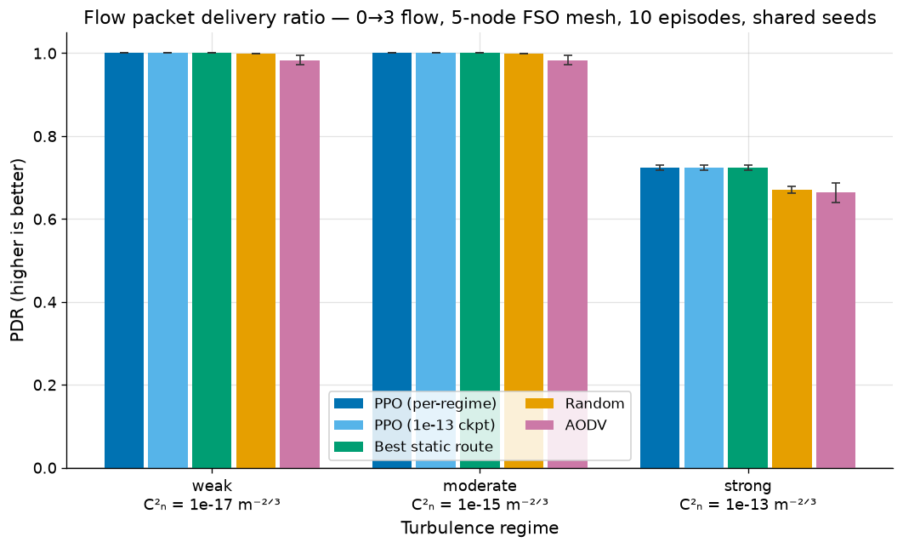

# FSO Network Simulator

[](https://github.com/aarushi-lakhi/fso-network-simulator-v2/actions/workflows/ci.yml)

A cross-layer **Free-Space Optical (FSO) network simulator** that connects physical-layer
atmospheric turbulence to network-layer routing decisions — and trains a deep RL agent to
route around the weather.

Three layers, one physics model:

```
┌────────────────────────────────────────────────────────────────────┐
│  prototype/            Gamma-Gamma turbulence math (NumPy/SciPy)   │
│  validated: SI = 1/α + 1/β + 1/(αβ) identity, BER curves           │
└──────────────┬─────────────────────────────────────────────────────┘
               │  same α, β, C²ₙ parameters everywhere
       ┌───────┴────────┐
       ▼                ▼
┌──────────────┐  ┌─────────────────────────────────────────────────┐
│ gr-fso-      │  │ ns3-fso-channel/     custom ns-3 contrib module │
│ turbulence/  │  │ GammaGammaFsoLossModel = Beer-Lambert extinction│
│ GNU Radio    │  │ + Gamma-Gamma fading; helper bridges fading to  │
│ fading block │  │ PointToPoint FSO links via time-varying PER     │
│ (IQ × √I)    │  └───────────────────────┬─────────────────────────┘
└──────────────┘                          ▼
                  ┌─────────────────────────────────────────────────┐
                  │ ns3-rl-router/     ns3-ai shared-memory Gym env │
                  │ + PyTorch PPO agent picking routes per step     │
                  │ obs: per-link SNR, drops, scintillation, queues │
                  └───────────────────────┬─────────────────────────┘
                                          ▼
                  ┌─────────────────────────────────────────────────┐
                  │ benchmarks/   PPO vs static / random / AODV     │
                  │ across weak → strong turbulence (C²ₙ sweep)     │
                  └─────────────────────────────────────────────────┘
```

## The physics

Atmospheric scintillation is modeled with the **Gamma-Gamma irradiance distribution**
(Andrews & Phillips, 2005): the received intensity is the product of two Gamma-distributed
processes (large- and small-scale eddies), with shape parameters α, β derived from the
plane-wave **Rytov variance** `σ²_R = 1.23 C²ₙ k^(7/6) L^(11/6)`. Links also suffer
deterministic **Beer-Lambert extinction** `exp(−σ_ext·d)`. The same closed forms drive the
Python prototype, the GNU Radio block, and the ns-3 loss model, so all three layers agree.



## Headline results

A PPO agent trained through ns-3 (live simulation, shared-memory Gym interface) routes a
UDP flow across a 5-node FSO mesh while turbulence knocks packets out. Training takes ~8
minutes for 800 episodes on an Apple Silicon laptop:



Benchmarked against classical baselines over 10 shared-seed episodes per cell
(full study: [`benchmarks/results/`](benchmarks/results/)):

| strong turbulence (C²ₙ = 10⁻¹³) | reward | packet delivery ratio | PHY drops/ep |
|---|---|---|---|
| **PPO (trained)** | **−731 ± 16** | **0.724 ± 0.007** | **675 ± 16** |
| best static route | −731 ± 16 | 0.724 ± 0.007 | 675 ± 16 |
| AODV | −858 ± 52 | 0.664 ± 0.024 | 807 ± 51 |
| random routing | −1233 ± 27 | 0.670 ± 0.008 | 805 ± 20 |



**The honest finding:** PPO converges to *exactly* the optimal policy — which, under
i.i.d. millisecond block fading with 100 ms decision steps, is "hold the best route."
It beats random by 41% and AODV (which pays real control overhead) by 15%, and matches
the best static route byte-for-byte per seed.

**The follow-up (Phase 6)** added temporally correlated fading — a Gaussian copula
AR(1) per Gamma component that preserves the exact Gamma-Gamma marginal while making
coherence time tunable — and re-ran the study. Channel memory turned out to be
necessary but not sufficient: even at τ = 500 ms with 50 ms decision steps, PPO still
converges to constant-route policies, because the per-episode variance dwarfs the
margin a well-timed switch buys.

**Phase 7 closed the loop** with a link-disjoint topology and TCP traffic, making
switching *provably* profitable: a two-line scripted rule (pick the route with the
best current per-link error rate) beats the best static route on 8 of 10 shared-seed
episodes in both correlated cells (+13.8 pp PDR under UDP, +75% goodput under TCP).
PPO — even frame-stacked at double budget — still collapses to a constant route with
near-zero policy entropy. The bottleneck is no longer the environment; it's the
optimizer: on-policy PPO under episode-return noise of ~25% of the mean retreats to
the safest constant action.

**Phase 8 proved it.** Behavior-cloning the scripted rule hands PPO a working
switching policy with a properly warmed-up critic — and fine-tuning *destroys* it in
both correlated cells, walking entropy from 0.65 to 0.005 nats and switches from 80
to 0 per episode (under TCP, from an initialization that already beat every static
route). Exploration is ruled out; the optimizer is the failure mode.

**Phase 9 completed the {PPO, DQN} × {scratch, BC-init} 2×2** with Double DQN, and the
verdict splits: from scratch, DQN collapses like PPO (but onto the *correct* constant
route — replay averaging fixes route selection); BC-initialized under UDP it becomes
the **only quadrant where switching survives** (stable 18 switches/ep over 80k steps,
+3.5 pp PDR over best-static, reward a statistical tie); under TCP the higher return
noise kills it faster than PPO. The binding constraint is the noise-to-action-gap
ratio, the scripted teacher remains unbeaten, and the standing hypothesis is that the
teacher's *hysteresis state* — the currently-held route — simply isn't in the
observation. Full paired analysis and trajectory plots in
[`benchmarks/results/README.md`](benchmarks/results/README.md).

## Repository layout

| Directory | What it is |
|---|---|
| [`prototype/`](prototype/) | Pure-Python Gamma-Gamma model (i.i.d. + correlated), 64 tests, publication plots |
| [`gr-fso-turbulence/`](gr-fso-turbulence/) | GNU Radio 3.10 OOT module: fading channel block + GRC demo |
| [`ns3-fso-channel/`](ns3-fso-channel/) | ns-3 contrib module: loss model, topology helper, test suite |
| [`ns3-rl-router/`](ns3-rl-router/) | ns3-ai Gym env (C++) + PPO agent (PyTorch), 36 tests |
| [`benchmarks/`](benchmarks/) | Comparison study: orchestrator, aggregation, plots, results |
| [`setup/`](setup/) | macOS install scripts (GNU Radio, ns-3.40, ns3-ai) + env verification |
| [`plan.md`](plan.md) | Living project plan: phases, decisions log, conventions |

## Getting started (macOS)

```bash
./setup/install_gnuradio.sh     # GNU Radio 3.10 via Homebrew
./setup/install_ns3.sh          # ns-3.40 → ~/fso-tools (patched for new libc++)
./setup/install_ns3_ai.sh       # ns3-ai module + python venv
./setup/verify_env.sh           # 11 PASS checks

# prototype tests + plots
cd prototype && python3 -m venv .venv && .venv/bin/pip install -r requirements.txt
.venv/bin/pytest tests/ && .venv/bin/python turbulence_plots.py
```

Notes: the ns-3 toolchain is pinned to Python 3.11 (`./ns3` breaks on 3.14); ns3-ai's
shared memory is verified working natively on Apple Silicon — details in
[`setup/README.md`](setup/README.md).

## Reproducing the RL results

```bash
./setup/link_fso_modules.sh                    # link modules into ns-3, build
source ~/fso-tools/ns3ai-venv/bin/activate     # python3 must resolve to 3.11
python ns3-rl-router/sim/check_env.py          # smoke-test the Gym env
python ns3-rl-router/agent/train.py --env ns3 --c2n 1e-13
python ns3-rl-router/agent/eval_policy.py --checkpoint ns3-rl-router/agent/checkpoints/ns3_ppo.pt
python benchmarks/run_benchmark.py --quick     # or the full study (~25 min, training dominates)
./setup/link_fso_modules.sh --unlink           # restore the ns-3 tree
```

See [`ns3-rl-router/agent/README.md`](ns3-rl-router/agent/README.md) and
[`benchmarks/results/README.md`](benchmarks/results/README.md) for exact workflows.

## Found along the way

- ns-3.40's test suite doesn't compile under current Apple libc++ (heterogeneous
  `std::pair` comparison makes its custom `operator==` ambiguous) — backported the
  upstream fix as [`setup/patches/`](setup/patches/).
- ns3-ai's `Ns3Env.reset()` silently drops your simulation settings from episode 2
  onward; `ns3-rl-router/agent/ns3_env.py` overrides `reset()` to re-apply them and
  advance the seed.
- ns3-ai's first build races its own protobuf codegen; the install script retries once.

## License

[GPL-2.0](LICENSE) — matching the ns-3 module sources, which carry GPLv2 headers per
ns-3 convention.
